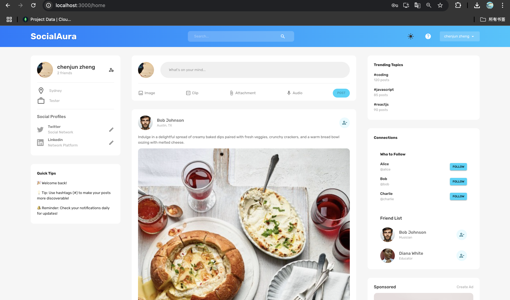

# SocialAura - MERN Stack Social Media App

## Project Overview

SocialAura is a full-stack social media application built with the MERN stack. It provides a modern, user-friendly interface for users to connect, share, and interact. Key features include user authentication, profile customization, post creation, dark mode, and more.

---

## Project Screenshots

### Login Page

Here’s a preview of the login page:


### Register Page

Here’s a preview of the register page:


### Home Page

Here’s a preview of the Home page:




---

### Key Features:

- **User Authentication**: Login and registration functionality.
- **Profile Customization**: Users can edit their name, profession, and location directly on the main page.
- **Friend Management**: Add or remove friends from your connections list.
- **Post Management**:
  - Create, edit, and delete posts.
  - Like and comment on posts from other users.
- **Dark Mode**: Toggle between dark and light themes.
- **Logout Functionality**: Securely log out of the application.
- **Responsive Design**: Fully optimized for different devices and screen sizes.

---

## Tech Stack

### Frontend:

- **React**: For building the user interface.
- **Material-UI**: A responsive and modern component library.
- **Redux Toolkit**: Global state management.
- **Redux Persist**: To persist state across sessions.
- **React Router**: For navigation and routing.
- **Formik & Yup**: Form handling and validation.

### Backend:

- **Node.js**: Backend runtime environment.
- **Express.js**: Web framework for building APIs.
- **Mongoose**: MongoDB object modeling.
- **JsonWebToken (JWT)**: Secure user authentication.
- **Multer & GridFS**: File uploads and storage.

### Database:

- **MongoDB**: Database for storing user and post data.

### Tools & Libraries:

- **dotenv**: Environment variable management.
- **Google Fonts**: Fonts for UI design.
- **VS Code**: Development environment.

---

## File Structure

### Frontend (`client`)

```
client/
├── public/
│   └── assets/           # Static images and files
├── src/
│   ├── components/       # Shared components (e.g., FlexBetween, Friend, etc.)
│   ├── scenes/           # Pages and UI logic (e.g., homepage, profile page)
│   ├── state/            # Redux state management
│   ├── App.js            # Main app entry point
│   ├── index.js          # ReactDOM entry point
├── .gitignore
├── package.json
```

### Backend (`server`)

```
server/
├── controllers/          # Business logic for users and posts
├── middleware/           # Middleware (e.g., authentication)
├── models/               # Database models (User, Post)
├── routes/               # API endpoints
├── public/assets         # Static files
├── .env                  # Environment variables
├── index.js              # Server entry point
├── package.json
```

---


## How to Run

### Prerequisites:

- Install [Node.js](https://nodejs.org/en/) and [MongoDB](https://www.mongodb.com/).

### Steps:

1. Clone the repository:

   ```bash
   git clone https://github.com/your-repository
   cd your-project
   ```

2. Install dependencies:

   ```bash
   # Frontend
   cd client
   npm install
   
   # Backend
   cd ../server
   npm install
   ```

3. Set up environment variables:
   Create a `.env` file in the `server` directory and include the following:

   ```env
   MONGO_URL=your-mongodb-url
   JWT_SECRET=your-jwt-secret
   PORT=5000
   ```

4. Run the application:

   ```bash
   # Start backend
   cd server
   npm start
   
   # Start frontend
   cd ../client
   npm start
   ```

5. Access the application:
   Open your browser and go to `http://localhost:3000`.

---

## Features in Detail

### User Management

- **Login and Registration**:
  - Secure authentication using JWT.
  - Passwords are hashed for security.

- **Profile Customization**:
  - Update name, profession, and location from the main page.

### Posts and Interactions

- Create posts with text and images.
- Like and comment on posts.
- Delete posts you own.

### Friend System

- Add and remove friends from your connections.

### UI and Accessibility

- Toggle between dark mode and light mode.
- Fully responsive design for mobile and desktop users.

---

## License

This project is licensed under the [MIT License](https://opensource.org/licenses/MIT).